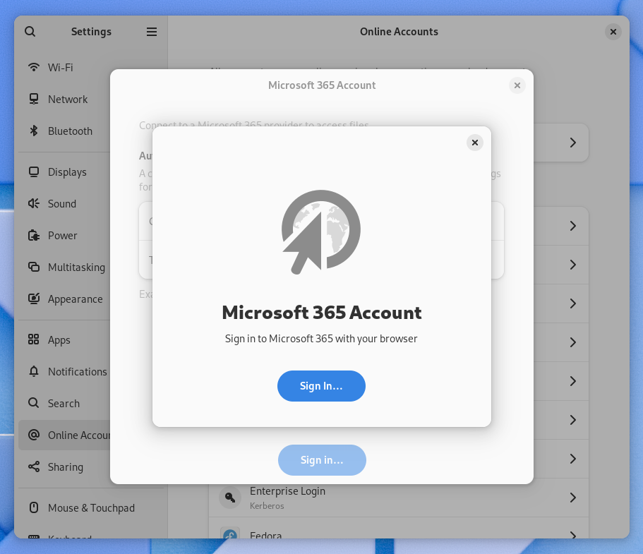

With GNOME 46.2 released, it seems like a good time to write a post about goings
on in GNOME Online Accounts and other STF-funded initiatives. There's a lot to
be excited about this cycle and most of it is leading to more improvements in
the near future.

## GNOME Online Accounts

A lot happened in GNOME 46 for GNOME Online Accounts, including two new
providers, a port to GTK4 and Adwaita, authentication in the desktop browser,
and a large refactoring towards contemporary platform conventions.

The new WebDAV and Microsoft 365 providers contrast quite a bit, although
both made progress in the general direction we want to move. The existing
Nexcloud provider was a good starting point for WebDAV, but support for more
implementations and auto-discovery were important goals for our push towards
open protocols and local-first principles.

### WebDAV

The WebDAV provider seemed like it would be fairly straightforward, however
feedback from the community has shown that several popular services like
Fastmail and mailbox.org offer support for features like custom domain names
and app passwords restricted by content type. These are great features, but
not supported by a naive implementation of standard service discovery.

The large refactoring in GNOME 46 de-duplicated a lot of code and is much easier
to use, but a lot of the account setup process is still tightly coupled to the
user interface. The new work being done to support more service configurations
and improve the user experience is separate from the provider code, which has
already led to the easy integration of some nice features:

<video controls>
  <source src="autoconfig-screencast.webm" />
  <track kind="captions" src="autoconfig-screencast.vtt" srclang="en" />
</video>

In the video above, you can see the implementation of [Mail Autoconfig] at work
detecting settings for Fastmail from the email address, in the otherwise
unchanged Email setup dialog. I'd like to thank Tyler and the rest of the
development team at [Fastmail] for extending me an account for additional
testing this cycle. By design, Mail Autoconfig doesn't need authentication, but
this account was very helpful while improving support for content-restricted app
passwords.

These app passwords are especially relevant to WebDAV, which received a few
adjustments to adopt an internal API compatible with the Mail Autoconfig
implementation. While the WebDAV setup dialog hasn't landed the same UI feedback
improvements yet, there is a work-in-progress that does:

<video controls>
  <source src="collection-account-screencast.webm" />
  <track kind="captions" src="collection-account-screencast.vtt" srclang="en" />
</video>

In this video, you can see an early prototype for a goal of a lot of this work.
Thanks to the research and work of Éloi Rivard we have an excellent whiteboard
for [Generic Service Providers], detailing a large amount of the subject matter.
The immediate goal then is to offer an account type that's easy to set up,
supports the common set of services (mail, calendar, contacts and files) and
adapts to the available services using open protocols and standards.

We still have longer-term changes planned to support a sandbox-friendly
ecosystem, but it's not yet clear what form GNOME Online Accounts will take or
how applications will interact with it. For this reason, all the new code
supporting Mail Autoconfig and WebDAV was written for potential reuse later,
without investing in becoming yet another [Accounts SSO].

[Mail Autoconfig]: https://benbucksch.github.io/autoconfig-spec/draft-autoconfig-1.html
[Fastmail]: https://www.fastmail.com/
[Generic Service Providers]: https://gitlab.gnome.org/Teams/Design/whiteboards/-/issues/186
[Accounts SSO]: https://accounts-sso.gitlab.io/

### Microsoft 365

Much of the recent work on GNOME Online Accounts was funded by the Sovereign
Tech Fund, while the Microsoft 365 provider is the work of [Jan-Michael Brummer].
The initial support includes access to OneDrive with [Files] and [GVfs], with
support for email, contacts and calendar planned for the near future. While our
focus remains on open protocols and local-first principles, it's still a goal
to support services that the people use in their work and provide benefit to
the community.

Something interesting the project gained from Jan's work is the first OAuth
provider with support for user-provided client IDs. Currently, every distributor
and fork of GNOME Online Accounts has been using the GNOME Foundation's client
IDs for OAuth providers. This can be problematic depending on the terms of
service and restrictive for those using enterprise or organizational accounts.

Unfortunately, the first iterations of the setup dialog did not result in a
good user experience. Microsoft's services come with their own concepts and
terminology, which really resulted in a lack of clear direction in the design
of the interface during an already busy release cycle. The tight coupling
between logic and user interface did not help here either, as evidenced by the
double-modal:

The amount of feedback and issues reported has been the most help here, as we
learn how Microsoft 365 is being used by the open-source community in both
personal and work-related environments. Support for more services like email,
calendar and contacts are planned, and hopefully some better support for
[organizational accounts].

[Jan-Michael Brummer]: https://gitlab.gnome.org/jbrummer
[Files]: https://apps.gnome.org/Nautilus/
[GVfs]: https://wiki.gnome.org/Projects/gvfs
[organizational accounts]: https://gitlab.gnome.org/GNOME/gnome-online-accounts/-/issues/335

## Orca and Spiel

Something I am thrilled to have the opportunity to take part in is [Spiel], a
new speech synthesis service by [Eitan Isaacson] that's a bit reminiscent of
[MPRIS]. New [speech providers] can be easily written in C, Rust or any other
language binding and [libspiel] will aggregate them for the client.

An interesting difference with [Speech Dispatcher] is that while the speech
provider takes responsibility for speech synthesis, the client application
takes responsibility for the audio output. Internally, the speech provider
returns a file descriptor over D-Bus and GStreamer is used to output the audio
on the client side.

While Spiel does have some exciting possibilities outside of screen readers,
including new synthesizers like [Piper], you may be surprised to find the
speech rate that many users operate a screen reader at. Léonie Watson has an
excellent blog post titled [Notes on synthetic speech], with plenty of audio
clips and insights into how screen readers are used by real people.

I was fortunate enough to have the opportunity to integrate Spiel into Orca,
which was a great learning experience and re-sparked my interest in
accessibility in general. Something else to watch out for is Matt Campbell's
[Newton] project, bringing a modern accessibility stack to Wayland.

[Spiel]: https://project-spiel.org
[Eitan Isaacson]: https://blog.monotonous.org/
[MPRIS]: https://specifications.freedesktop.org/mpris-spec/latest/
[speech providers]: https://github.com/project-spiel/libspeechprovider
[libspiel]: https://github.com/project-spiel/libspiel
[Speech Dispatcher]: https://github.com/brailcom/speechd
[Piper]: https://github.com/rhasspy/piper
[Notes on synthetic speech]: https://tink.uk/notes-on-synthetic-speech/
[Newton]: https://gitlab.gnome.org/mwcampbell/gtk/tree/accesskit#experimental-accesskit-integration

## Acknowledgements

I'd like to again thank the [Sovereign Tech Fund] for investing in the GNOME
project. Their targeted funding of infrastructure and accessibility has
empowered a lot of overdue improvements for open source and the GNOME platform.

I'd also like to thank the development team at [Fastmail], who upon request
graciously granted us an extended account, to continue testing support for their
service. The support staff at [mailbox.org] also extended a trial period as a
show of good faith. It's been really encouraging to have these companies show
support for the community, thank you!

As always, GNOME's community of contributors and users have been the most help,
with diligent reporting, code reviews and advice. There are so many things
happening in open source, I really wouldn't be able to keep up without all your
help.

[Sovereign Tech Fund]: https://www.sprind.org/en/projects/sovereign-tech-fund/
[Fastmail]: https://fastmail.com
[mailbox.org]: https://mailbox.org

