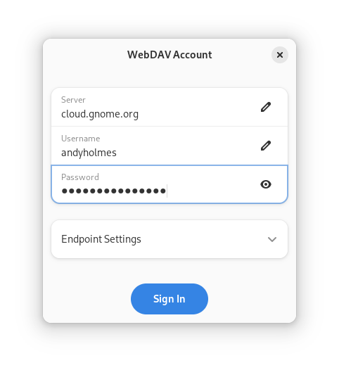
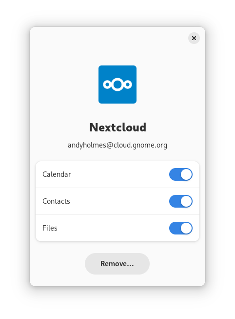
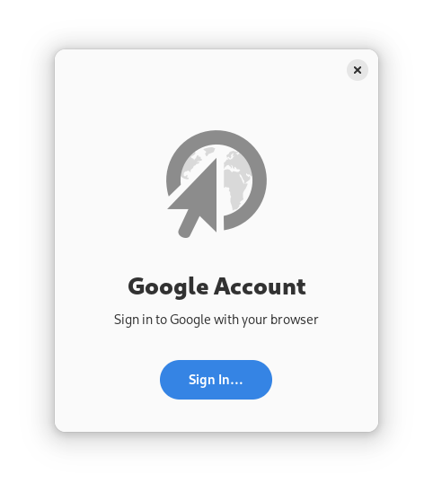
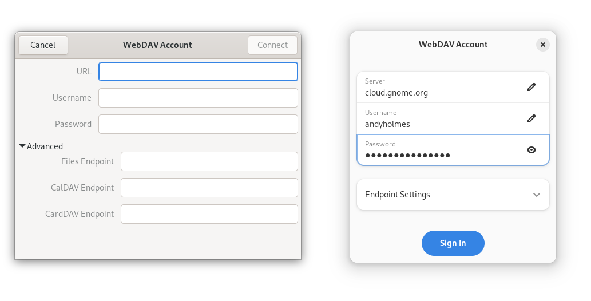

One of our goals for the [Sovereign Tech Fund] is to modernize platform
infrastructure, in line with the mission to support security and resilience in
open source software. For GNOME Online Accounts, this meant tightening up the
code base and shifting focus to prioritize open protocols.

A significant portion of the backend was refactored and tested in tandem with
the GNOME Settings side of Online Accounts. By working with development tools
like [AddressSanitizer] we identified and fixed a number of memory and type
safety issues in both projects and helped to ensure the resiliency of any new
code.

[AddressSanitizer]: https://en.wikipedia.org/wiki/AddressSanitizer
[Sovereign Tech Fund]: https://foundation.gnome.org/2023/11/09/gnome-recognized-as-public-interest-infrastructure/

## What did we do

The first thing we wanted to do was get a [general WebDAV provider merged].
This work was a multi-phase community effort and the majority of the work as
part of the STF was adding and testing more thorough and resuable code for DAV
discovery and configuration.

The new WebDAV provider then became a base for the Nextcloud provider, which is
now simply a branded version.

Another big step to improving reliability and maintainability is updating to
the latest dependencies and industry conventions. This meant first
[supporting OAuth 2.0] in a standard browser so, for example, when you log into
a Google account you're doing it with your preferred, trusted browser. This
allowed us to remove the old WebKit2 dependency and
[port to GTK4 and libadwaita].

Although the user interface for adding an account is simple, each account type
needs its own, so GNOME Online Accounts has traditionally had a strange API and
behavior. In the GTK3 days we used modal dialogs and nested loops in ways that
really didn't work out. Nowadays we often approach user tasks like
*"Pick a File"* with simple task-based APIs and now GNOME Online Accounts does,
too.

[supporting OAuth 2.0]: https://gitlab.gnome.org/GNOME/gnome-online-accounts/-/merge_requests/139
[general WebDAV provider merged]: https://gitlab.gnome.org/GNOME/gnome-online-accounts/-/merge_requests/137
[port to GTK4 and libadwaita]: https://gitlab.gnome.org/GNOME/gnome-online-accounts/-/merge_requests/142

## The Future of Online Accounts

When we're talking about Single Sign-On with GNOME, we're talking about
authenticating an account once and making it available to multiple desktop
applications. You log into Nextcloud, then when you open GNOME Contacts or
Calendar it can access your data using the account credentials. Aside from
other hurdles in the project, we have no ability to enforce any real trust
model, let alone selectively by application or content type.

The future of GNOME Online Accounts then has less to do with accounts and
services than it does with security and content. A user shouldn't have to
worry about a calendar app scraping their e-mails and the developer shouldn't
have to care about OAuth 2.0 or RFC 5545. [Tracker] provides a sandbox-friendly
data storage framework with a feature set we can build on to give users more
control and developers less legwork.

Other aspects of the project have a less certain future.
[libgdata is currently without a maintainer] and having the GNOME Foundation's
provider client IDs used almost universally has left us in an awkward
relationship with service providers like Google and Microsoft.

This doesn't mean GNOME Online Accounts is going away, but that we're
re-orienting to best provide control to users and simplicity to developers.
Prioritizing open protocols like WebDAV and modernizing the code base are
first steps towards less dependence on closed services and tighter security.
A few of our next steps will include new libraries that provide controlled
access to content (e.g. contacts) without exposing account credentials to
applications.

[Tracker]: https://gnome.pages.gitlab.gnome.org/tracker/overview.html
[libgdata is currently without a maintainer]: https://discourse.gnome.org/t/giving-up-maintainership-of-libgdata/9983

## Corporate Users

We'd like make a point of inviting our corporate users to reach out and
contribute. Some are already in contact or have contributions waiting for
review and we thank you for your patience.

Since the focus moving forward will be on open protocols, we will be relying
more on contributions from the community to help maintain support for closed
services. If you are a business or work for a business that benefits from
integration of a proprietary service, consider sponsoring an employee or a
developer in the community for support and maintenance of these services.

Contributing upstream is a great way to give back and shows you're an active
part of an industry embracing open source, especially if you are the service
provider. The GNOME Foundation is always proud to announce collaborations with
other parties in its press releases, which reach many other corporate partners
and related markets.

## Acknowledgements

We'd like to thank the [Sovereign Tech Fund] for investing in GNOME Online
Accounts. With most maintainers stretched thin, the opportunity to get everyone
together for video meetings and the time to take in a whole new codebase would
not have been possible without their support.

We'd also like to thank the many members of the GNOME community who lent their
experience and ideas, as well as [Christoph Wurst] from Nextcloud who joined
in on a meeting. The work on this project really wouldn't be possible without
the combined talent of various backgrounds.

[Christoph Wurst]: https://blog.wuc.me/
